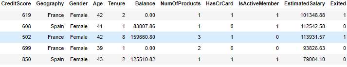
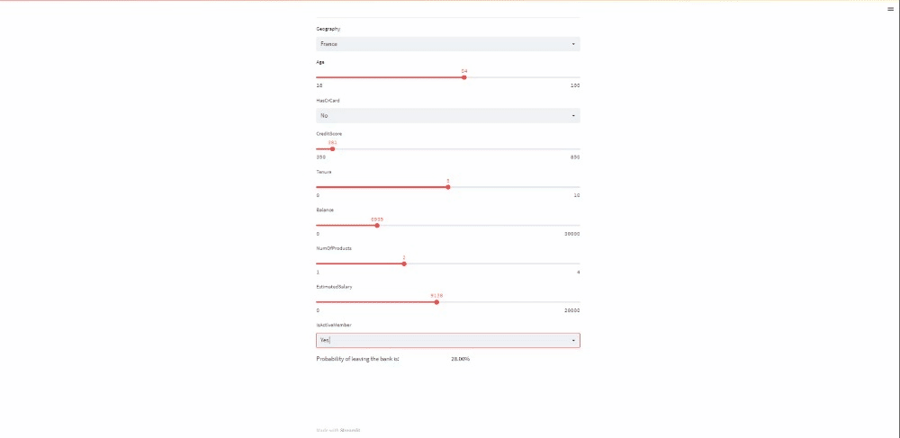

# Bank Churn Rate

## Why do we need to predict the churn rate for a bank
Banks are financial institutions that needs customer to strive. It is expensive for these bank to sign in new customers. So retaining these customers is needed for the bank. So looking at certain factors we can determine whether a certain customer will leave the bank or not

## Let's look at the data
The data is collected from [kaggle](https://www.kaggle.com/datasets/mathchi/churn-for-bank-customers). The dataset consists of 10000 rows and 14 attributes.



The 14 attributes are:

1. **CreditScore**: credit score of the customer. 
2. **Geography** : Location of the bank are also considered.list of three places(Germany, France & Spain).
3. **Gender** : Whether gender plays a role in customer leaving the bank.
4. **Age**: Different age groups have different levels of loyalty.
5. **Tenure**: Number of months a customer is subscribed to.
6. **Balance**: Amount of money a customer have in their account.
7. **NumOfProducts**: The number of products that a customer has purchased through the bank.
8. **HasCrCard**: whether a customer has a credit card or not. Since people with a credit card are less likely to leave the bank.
9. **IsActiveMember**: Active customer are less likely to leave.
10. **EstimatedSalary**: Lower income customers tend to likely leave banks. 

## Exploring the data
Using different tools and methodologies to check the data.

## The different models

1. **Logistic Regression**: [Logistic Regression](https://scikit-learn.org/stable/modules/generated/sklearn.linear_model.LogisticRegression.html) is a Machine Learning classification algorithm that is used to predict the probability of a categorical dependent variable.


```
from sklearn.linear_model import LogisticRegression

logreg=LogisticRegression()
logreg.fit(X_train,y_train)
y_pred=logreg.predict(X_test)
```

2. **RandomForest Classifier**: [Random Forest](https://scikit-learn.org/stable/modules/generated/sklearn.ensemble.RandomForestClassifier.html) is a classifier that contains a number of decision trees on various subsets of the given dataset and takes the average to improve the predictive accuracy of that dataset.


```
rf = RandomForestClassifier(n_estimators = 100, random_state = 0)
rf.fit(X_train, y_train)

y_pred = rf.predict(X_test)
```

3. **XGBoost Classifier**: [XGBoost](https://xgboost.readthedocs.io/en/stable/) is an optimized distributed gradient boosting library designed to be highly efficient, flexible and portable. It implements machine learning algorithms under the Gradient Boosting framework. 


|Value | Model | Precision | Recall | F1-score|
|------|------|------|------|------|
|0| Logistic Regression |0.88| 0.96 |0.92|
|1|  Logistic Regression| 0.76|0.51  |   0.61|
|0| RandomForestClassifier|0.88 |0.96  |0.92|
|1| RandomForestClassifier|0.76 |0.51  |0.61|
|0| RandomForestClassifier|0.88 |0.96  |0.92|
|0| XGBoost Classifier|0.89 |0.95  |0.91|
|1| XGBoost Classifier|0.72|0.53   |   0.61

***Fig** :Precision,Recall & F1-score of three of the model*


| Model | Accuracy |
|------|------|
| Logistic Regression |0.87|
|RandomForest Classifier|0.87 |
| XGBoost Classifier|0.86 |

***Fig** : Accuracy of three of the model*

## Visualizing the model using **Streamlit**

Streamlit is an open-source Python library that makes it easy to create and share beautiful, custom web apps for machine learning and data science. 

```
pip install streamlit
streamlit run 
```
***Fig** : Streamlit installation*

## Dockerizing the app

Docker is a software framework for building, running, and managing containers on servers and the cloud.
Create an image of the app and run it on docker.
```
docker build --t churn-prediction:1.0 .
```
*Building an image of the app* 

## Final App




